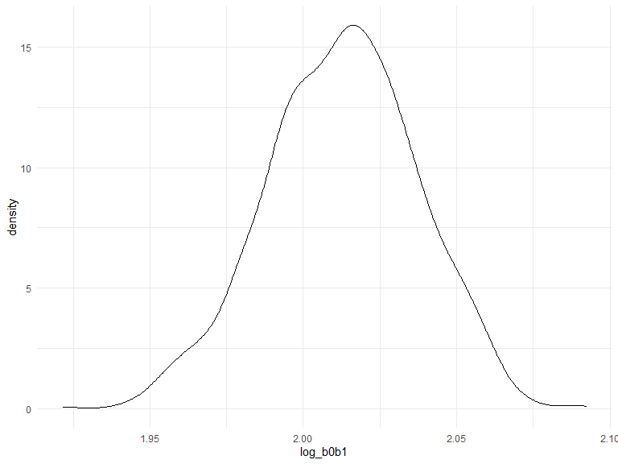

p8105_hw6_hm2946
================
min
2022-12-02

## Problem 1

*Download the data*

``` r
weather_df = 
  rnoaa::meteo_pull_monitors(
    c("USW00094728"),
    var = c("PRCP", "TMIN", "TMAX"), 
    date_min = "2017-01-01",
    date_max = "2017-12-31") %>%
  mutate(
    name = recode(id, USW00094728 = "CentralPark_NY"),
    tmin = tmin / 10,
    tmax = tmax / 10) %>%
  select(name, id, everything())
```

    ## Registered S3 method overwritten by 'hoardr':
    ##   method           from
    ##   print.cache_info httr

    ## using cached file: C:\Users\hongpu\AppData\Local/Cache/R/noaa_ghcnd/USW00094728.dly

    ## date created (size, mb): 2022-12-02 14:35:47 (8.443)

    ## file min/max dates: 1869-01-01 / 2022-11-30

*Plot r.squared*

``` r
rsquared_weather = 
  weather_df %>% 
  modelr::bootstrap(n = 1000) %>% 
  mutate(
    models = map(strap, ~lm(tmax ~ tmin, data = .x) ),
    results = map(models, broom::glance)) %>% 
  select(-strap, -models) %>% 
  unnest(results)

rsquared_weather %>% 
  ggplot(aes(x = r.squared)) + geom_density()
```


*The graph is skewed to the left and has some outliers.*

``` r
rsquared_quantiles = 
  rsquared_weather %>% 
  select(r.squared) %>%
  arrange(r.squared)

rsquared_quantiles[c(25,975),]
```

    ## # A tibble: 2 × 1
    ##   r.squared
    ##       <dbl>
    ## 1     0.893
    ## 2     0.927

*95% CI for r.squared is (0.895,0.927)*

*Plot log_b0b1*

``` r
log_weather = 
  weather_df %>% 
  modelr::bootstrap(n = 1000) %>% 
  mutate(
    models = map(strap, ~lm(tmax ~ tmin, data = .x) ),
    results = map(models, broom::tidy)) %>% 
  select(-strap, -models) %>% 
  unnest(results) %>% 
  select(id = `.id`, term, estimate) %>% 
  pivot_wider(
    names_from = term, 
    values_from = estimate) %>% 
  rename(beta0 = `(Intercept)`, beta1 = tmin) %>% 
  mutate(log_b0b1 = log(beta0 * beta1))

log_weather %>% 
  ggplot(aes(x = log_b0b1)) + geom_density()
```


*The graph is skewed to the left and has some outliers.*

``` r
log_quantiles = 
  log_weather %>% 
  select(log_b0b1) %>%
  arrange(log_b0b1)

log_quantiles[c(25,975),]
```

    ## # A tibble: 2 × 1
    ##   log_b0b1
    ##      <dbl>
    ## 1     1.96
    ## 2     2.06

*95% CI for log is (1.96,2.06)*
