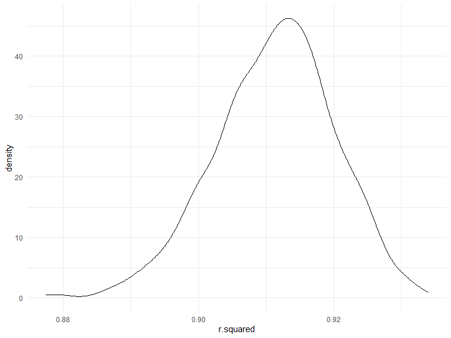

p8105_hw6_hm2946
================
min
2022-12-02

## Problem 1

*Download the data*

``` r
weather_df = 
  rnoaa::meteo_pull_monitors(
    c("USW00094728"),
    var = c("PRCP", "TMIN", "TMAX"), 
    date_min = "2017-01-01",
    date_max = "2017-12-31") %>%
  mutate(
    name = recode(id, USW00094728 = "CentralPark_NY"),
    tmin = tmin / 10,
    tmax = tmax / 10) %>%
  select(name, id, everything())
```

    ## Registered S3 method overwritten by 'hoardr':
    ##   method           from
    ##   print.cache_info httr

    ## using cached file: C:\Users\hongpu\AppData\Local/Cache/R/noaa_ghcnd/USW00094728.dly

    ## date created (size, mb): 2022-12-02 14:35:47 (8.443)

    ## file min/max dates: 1869-01-01 / 2022-11-30

*Plot r.squared*

``` r
rsquared_weather = 
  weather_df %>% 
  modelr::bootstrap(n = 1000) %>% 
  mutate(
    models = map(strap, ~lm(tmax ~ tmin, data = .x) ),
    results = map(models, broom::glance)) %>% 
  select(-strap, -models) %>% 
  unnest(results)

rsquared_weather %>% 
  ggplot(aes(x = r.squared)) + geom_density()
```


*The graph is skewed to the left and has some outliers.*

``` r
rsquared_quantiles = 
  rsquared_weather %>% 
  select(r.squared) %>%
  arrange(r.squared)

rsquared_quantiles[c(25,975),]
```

    ## # A tibble: 2 × 1
    ##   r.squared
    ##       <dbl>
    ## 1     0.893
    ## 2     0.927

*95% CI for r.squared is (0.895,0.927)*

*Plot log_b0b1*

``` r
log_weather = 
  weather_df %>% 
  modelr::bootstrap(n = 1000) %>% 
  mutate(
    models = map(strap, ~lm(tmax ~ tmin, data = .x) ),
    results = map(models, broom::tidy)) %>% 
  select(-strap, -models) %>% 
  unnest(results) %>% 
  select(id = `.id`, term, estimate) %>% 
  pivot_wider(
    names_from = term, 
    values_from = estimate) %>% 
  rename(beta0 = `(Intercept)`, beta1 = tmin) %>% 
  mutate(log_b0b1 = log(beta0 * beta1))

log_weather %>% 
  ggplot(aes(x = log_b0b1)) + geom_density()
```


*The graph is skewed to the left and has some outliers.*

``` r
log_quantiles = 
  log_weather %>% 
  select(log_b0b1) %>%
  arrange(log_b0b1)

log_quantiles[c(25,975),]
```

    ## # A tibble: 2 × 1
    ##   log_b0b1
    ##      <dbl>
    ## 1     1.96
    ## 2     2.06

*95% CI for log is (1.96,2.06)*

## Problem 2

``` r
homi_cide = read_csv("data/homicide-data.csv") %>% 
  mutate(
    city_state = str_c(city,state,sep = ","),
    resolved = as.numeric(disposition == "Closed by arrest"),
    victim_age = as.numeric(victim_age),
    victim_race = fct_relevel(victim_race, "White")) %>% 
  select(city_state, resolved, victim_age, victim_race, victim_sex) %>% 
  filter(victim_race == c("White","Black")) %>% 
  filter(city_state != c("Dallas,TX", "Phoenix,AZ", "Kansas City,MO", "Tulsa,AL"))
```

    ## Rows: 52179 Columns: 12
    ## ── Column specification ────────────────────────────────────────────────────────
    ## Delimiter: ","
    ## chr (9): uid, victim_last, victim_first, victim_race, victim_age, victim_sex...
    ## dbl (3): reported_date, lat, lon
    ## 
    ## ℹ Use `spec()` to retrieve the full column specification for this data.
    ## ℹ Specify the column types or set `show_col_types = FALSE` to quiet this message.

#### Baltimore

``` r
baltimore_homi = homi_cide %>% 
  filter(city_state ==  "Baltimore,MD")

balitmore_logistic = baltimore_homi %>% 
  glm(resolved ~ victim_age + victim_race + victim_sex, data = ., family = binomial()) 

balitmore_logistic %>% 
  broom::tidy() %>% 
  mutate(OR = exp(estimate),
         ci_lower = exp(estimate - 1.96*std.error),
         ci_upper = exp(estimate + 1.96*std.error)) %>%
  filter(term == "victim_sexMale") %>% 
  select(term, log_OR = estimate, OR, ci_lower, ci_upper) %>%
  knitr::kable(digits = 3)
```

| term           | log_OR |    OR | ci_lower | ci_upper |
|:---------------|-------:|------:|---------:|---------:|
| victim_sexMale |  -0.94 | 0.391 |    0.266 |    0.573 |

#### Each city

``` r
each_homi = 
  homi_cide %>% 
  nest(-city_state) %>% 
  mutate(
    models = map(data,~glm(resolved ~ victim_age + victim_race + victim_sex, data = .x, family = binomial())),
    results = map(models, broom::tidy)
    ) %>% 
  select(-data, -models) %>% 
  unnest(results) %>% 
  select(city_state, term, estimate, std.error) %>% 
  filter(term == "victim_sexMale") %>%
  pivot_wider(
    names_from = term, values_from = c(estimate,std.error)
    ) %>% 
  select(city_state, "estimate" = estimate_victim_sexMale, 
         "std" = std.error_victim_sexMale) %>% 
  mutate(OR = exp(estimate),
         ci_lower = exp(estimate - 1.96 * std),
         ci_upper = exp(estimate + 1.96 * std)) %>% 
  select(-estimate,-std)

each_homi %>% 
  knitr::kable(digits = 3)
```

| city_state        |    OR | ci_lower | ci_upper |
|:------------------|------:|---------:|---------:|
| Albuquerque,NM    | 2.088 |    0.698 |    6.249 |
| Atlanta,GA        | 1.344 |    0.802 |    2.253 |
| Baltimore,MD      | 0.391 |    0.266 |    0.573 |
| Baton Rouge,LA    | 0.253 |    0.103 |    0.621 |
| Birmingham,AL     | 0.666 |    0.372 |    1.194 |
| Boston,MA         | 0.934 |    0.402 |    2.169 |
| Buffalo,NY        | 0.548 |    0.213 |    1.410 |
| Charlotte,NC      | 0.654 |    0.322 |    1.327 |
| Chicago,IL        | 0.397 |    0.301 |    0.524 |
| Cincinnati,OH     | 0.364 |    0.166 |    0.802 |
| Columbus,OH       | 0.609 |    0.367 |    1.010 |
| Denver,CO         | 0.704 |    0.238 |    2.082 |
| Detroit,MI        | 0.579 |    0.416 |    0.806 |
| Durham,NC         | 0.710 |    0.218 |    2.311 |
| Fort Worth,TX     | 0.709 |    0.358 |    1.404 |
| Fresno,CA         | 1.509 |    0.430 |    5.289 |
| Houston,TX        | 0.529 |    0.372 |    0.752 |
| Indianapolis,IN   | 0.960 |    0.623 |    1.478 |
| Jacksonville,FL   | 0.497 |    0.323 |    0.764 |
| Las Vegas,NV      | 0.868 |    0.543 |    1.385 |
| Long Beach,CA     | 0.230 |    0.048 |    1.109 |
| Los Angeles,CA    | 0.604 |    0.365 |    0.999 |
| Louisville,KY     | 0.453 |    0.227 |    0.903 |
| Memphis,TN        | 0.704 |    0.454 |    1.092 |
| Miami,FL          | 0.410 |    0.201 |    0.837 |
| Milwaukee,wI      | 0.668 |    0.403 |    1.106 |
| Minneapolis,MN    | 1.731 |    0.668 |    4.486 |
| Nashville,TN      | 0.918 |    0.488 |    1.726 |
| New Orleans,LA    | 0.537 |    0.341 |    0.847 |
| New York,NY       | 0.126 |    0.042 |    0.377 |
| Oakland,CA        | 0.494 |    0.266 |    0.918 |
| Oklahoma City,OK  | 0.999 |    0.508 |    1.963 |
| Omaha,NE          | 0.353 |    0.144 |    0.865 |
| Philadelphia,PA   | 0.507 |    0.354 |    0.726 |
| Pittsburgh,PA     | 0.574 |    0.305 |    1.081 |
| Richmond,VA       | 0.712 |    0.243 |    2.087 |
| San Antonio,TX    | 0.744 |    0.338 |    1.636 |
| Sacramento,CA     | 0.638 |    0.254 |    1.600 |
| Savannah,GA       | 0.536 |    0.188 |    1.526 |
| San Bernardino,CA | 0.728 |    0.187 |    2.834 |
| San Diego,CA      | 0.353 |    0.128 |    0.969 |
| San Francisco,CA  | 0.403 |    0.138 |    1.174 |
| St. Louis,MO      | 0.641 |    0.438 |    0.937 |
| Stockton,CA       | 1.180 |    0.375 |    3.717 |
| Tampa,FL          | 0.315 |    0.072 |    1.375 |
| Tulsa,OK          | 0.776 |    0.399 |    1.510 |
| Washington,DC     | 0.576 |    0.340 |    0.974 |
